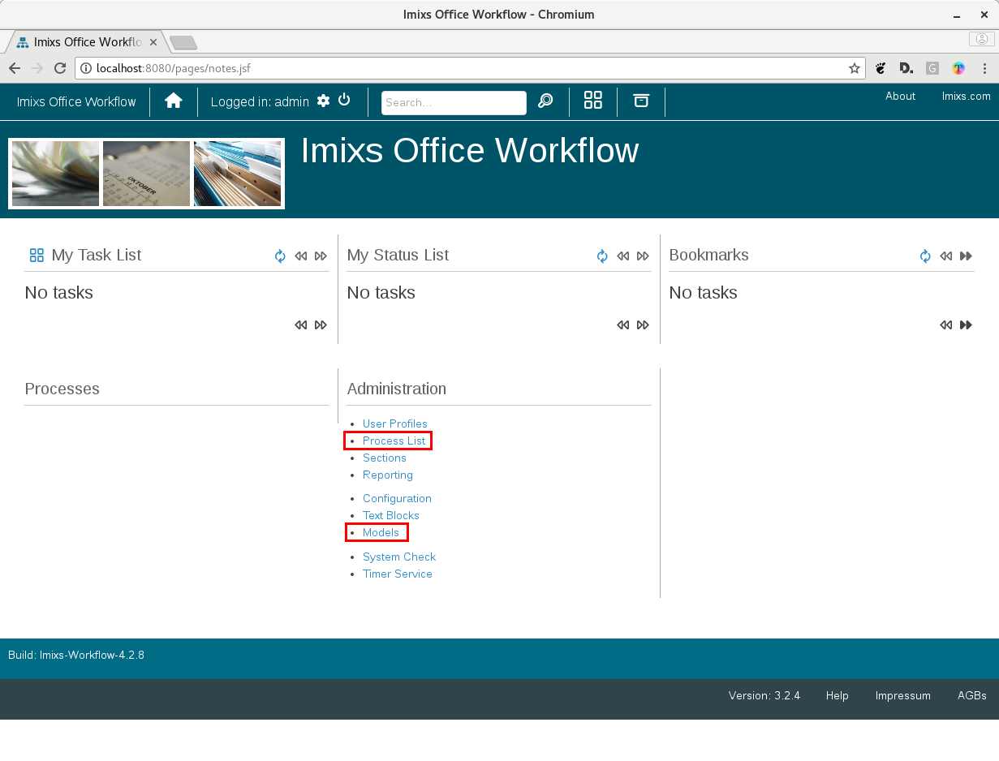
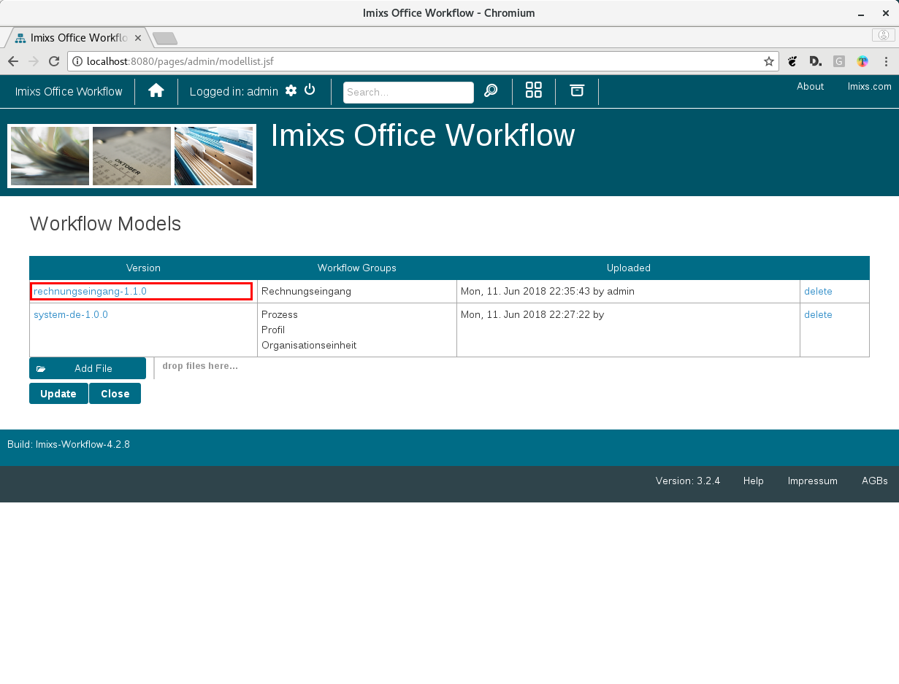
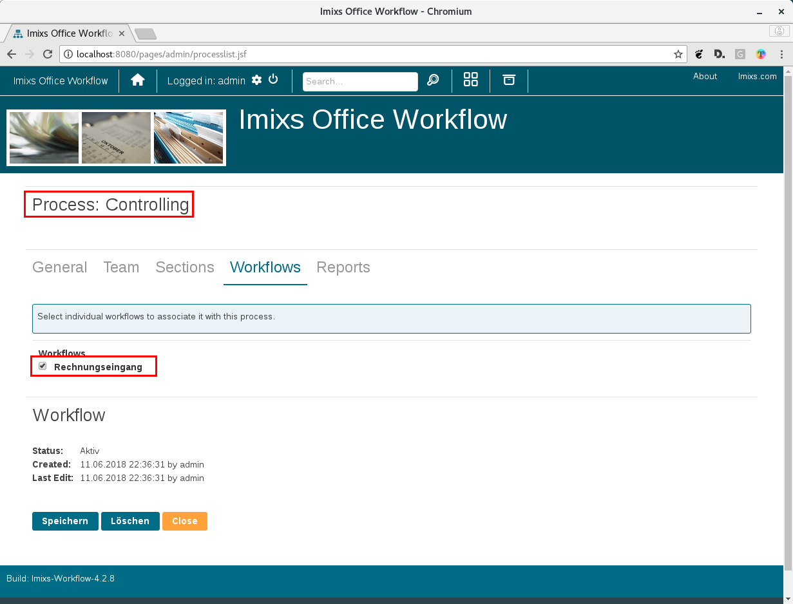
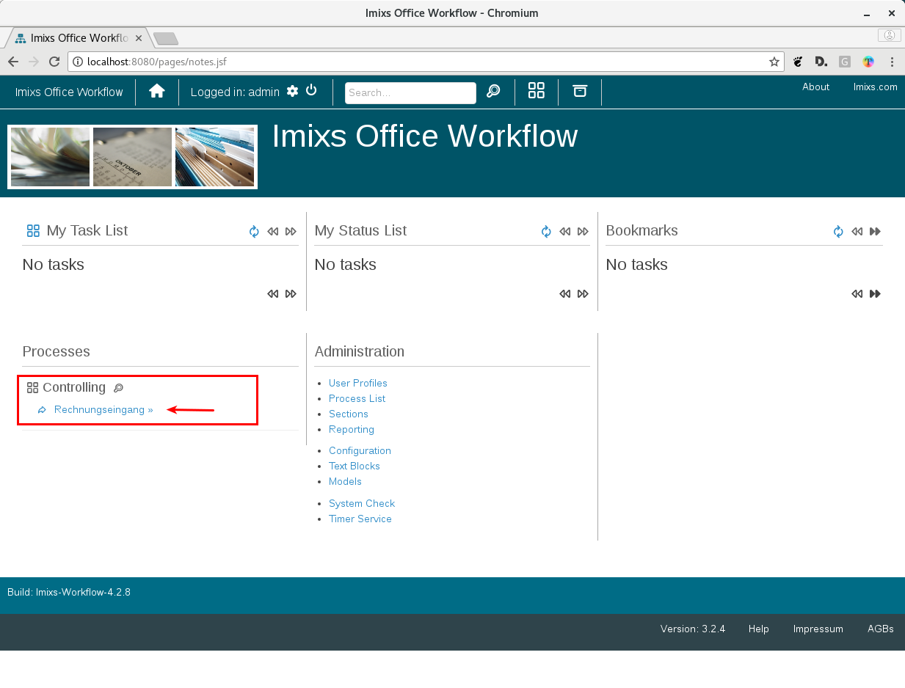

# Dynamixs.AI – Partner Integration Guide

This guide explains how to integrate the Dynamixs.AI platform into your customer projects.
There are two fundamentally different approaches — choose the one that fits your needs.

---

## Two Ways to Deploy Dynamixs.AI

### Option A – Quick Start with Docker Compose

The fastest way to get started. You run the pre-built Dynamixs.AI image using the official
Docker Compose setup. No build step is required. This approach is ideal for:

- Evaluating the platform
- Standard deployments without UI customizations
- Projects where customer-specific logic lives in external services (e.g. ERP connectors via REST)

All you need is Docker, a `docker-compose.yml`, and an LLM endpoint configuration file. You can find in the directory of this project:

- `docker/docker-compose.yaml` – Standard deployment
- `docker/docker-compose-dev.yaml` – Developer deployment for custom builds

### Option B – Custom Build (WAR Overlay)

A Maven-based build that extends the Dynamixs.AI platform with your own UI components,
CDI beans, and Java services. This approach is ideal for:

- Deep UI customization (branding, custom JSF components, form parts)
- Customer-specific Java services deployed inside the application server
- Long-lived partner products maintained across platform upgrades

Both options use the same Docker infrastructure underneath — the difference is
whether you use the pre-built image or build your own WAR first.

---

## Prerequisites

- Docker & Docker Compose
- A Dynamixs.AI Partner Account on GitHub (required for Option B)
- An LLM endpoint compatible with the OpenAI API (for AI features)

> **Becoming a Partner**
> Contact us at partner@dynamixs.ai to get access to the Dynamixs.AI GitHub packages and partner resources.

---

## Option A: Quick Start with Docker Compose

### 1. Get the Docker Compose file

Use the official `docker-compose.yml` provided by Dynamixs.AI. It includes all required
services out of the box:

| Service              | Description                   |
| -------------------- | ----------------------------- |
| Wildfly 32           | Jakarta EE Application Server |
| PostgreSQL           | Primary database              |
| Cassandra            | Archive / document store      |
| Apache Tika          | OCR service                   |
| Collabora Online     | Document editing (WOPI)       |
| Prometheus + Grafana | Monitoring                    |

### 2. Configure the LLM endpoint

Dynamixs.AI uses an LLM endpoint registry file (`imixs-llm.xml`) to connect to AI services.
Create this file and place it somewhere accessible to the container (e.g. `./keys/imixs-llm.xml`).

**Example `imixs-llm.xml`:**

```xml
<?xml version="1.0" encoding="UTF-8"?>
<imixs-llm>

    <!--
        Completion endpoint - used for chat completions, conditions, and analysis.
        Connects to a local llama.cpp server or any OpenAI-compatible API.
    -->
    <endpoint id="my-llm">
        <url>http://localhost:8080/</url>
        <apikey>${env.LLM_API_KEY}</apikey>
        <options>
            <temperature>0.2</temperature>
            <max_tokens>1024</max_tokens>
        </options>
    </endpoint>

    <!--
        Embedding endpoint - used for RAG indexing and retrieval.
        Can be hosted separately; no API key needed for local instances.
    -->
    <endpoint id="my-embeddings">
        <url>http://localhost:8081/</url>
        <options>
            <max_tokens>512</max_tokens>
        </options>
    </endpoint>

</imixs-llm>
```

Endpoints are referenced by their `id` in the BPMN process configuration:

```xml
<!-- Simple completion task -->
<imixs-ai name="CONDITION">
    <endpoint>my-llm</endpoint>
</imixs-ai>

<!-- RAG task with separate embeddings endpoint -->
<imixs-ai name="RAG_INDEX">
    <endpoint-completion>my-llm</endpoint-completion>
    <endpoint-embeddings>my-embeddings</endpoint-embeddings>
</imixs-ai>
```

Environment variable placeholders like `${env.LLM_API_KEY}` are resolved at runtime.
You can define them in `./docker/.env`:

```
LLM_API_ENDPOINT=https://my.llama.cpp.foo.com/
LLM_API_KEY=your-api-key-here
```

### 3. Start the stack

```bash
docker compose up -d
```

The application will be available at `http://localhost:8080`.

---

## Setup your Application

After the stack is up and running, open your browser at `http://localhost:8080` and log in
with the default admin account (`admin` / `adminadmin`).

You need to complete four steps to get your first workflow running:

### 1. Upload a BPMN Workflow Model

Go to **Administration → Models** and upload a BPMN file. Ready-to-use templates are
available in our [BPMN library](https://github.com/dynamixs-ai/bpmn-library).



### 2. Create a Process

Go to **Administration → Processes** and create a new process.



### 3. Assign the Workflow Model

Assign the uploaded BPMN model to your new process.



### 4. Start the Workflow

The new process now appears on the home screen. Click on it to start the corresponding workflow.



---

## Option B: Custom Build (WAR Overlay)

This option is based on the Maven WAR Overlay mechanism. The Dynamixs.AI platform UI
(`dynamixs-platform-ui`) is used as the base WAR. Your files in `src/main/webapp/`
automatically take precedence over files from the base WAR.

The build chain looks like this:

```
imixs-office-workflow-app   (WAR, public on Sonatype)
        ↓ overlay
dynamixs-platform-ui        (WAR, Dynamixs.AI GitHub Packages)
        ↓ overlay
acme-workflow               (WAR, your custom build)
```

Each layer only overrides what it needs — everything else is inherited from below.

### Prerequisites

- Java 17+
- Maven 3.9+
- A Dynamixs.AI Partner Account on GitHub

### 1. Configure Maven credentials

Add the following to your local `~/.m2/settings.xml`:

```xml
<settings>
    <servers>
        <server>
            <id>github-dynamixs</id>
            <username>YOUR_GITHUB_USERNAME</username>
            <!-- Personal Access Token with read:packages permission -->
            <password>YOUR_GITHUB_TOKEN</password>
        </server>
    </servers>
</settings>
```

Create a GitHub Personal Access Token with `read:packages` permission here:
https://github.com/settings/tokens

### 2. Clone the partner template

```bash
git clone https://github.com/dynamixs-ai/partner-template.git acme-workflow
cd acme-workflow
```

### 3. Customize `pom.xml`

Change `groupId`, `artifactId`, and `finalName` to match your customer project:

```xml
<groupId>com.acme</groupId>
<artifactId>acme-workflow</artifactId>
...
<finalName>acme-workflow</finalName>
```

### 4. Build

```bash
mvn clean package
```

The custom WAR file will appear in `target/`.

---

## Customizing the UI (Option B)

To override a file (CSS, XHTML, JSF component) simply copy it into `src/main/webapp/`.
Maven will automatically prefer your version over the base.

To inspect all available files you can override, unpack the base WAR:

```bash
mvn dependency:unpack -Dartifact=ai.dynamixs:dynamixs-platform-ui:LATEST:war -DoutputDirectory=target/platform-ui
```

Browse `target/platform-ui/` and copy any file you want to customize into `src/main/webapp/`.

**Example: override the default stylesheet**

```
src/main/webapp/resources/css/custom.css
```

---

## Adding Customer-specific Code (Option B)

Add your own CDI beans and services under `src/main/java/`. For example a connector
to an ERP system:

```
src/main/java/
└── com/acme/
    └── erp/
        └── SAPConnector.java
```

This code is owned by your customer — not by Dynamixs.AI.

Add the corresponding dependency in your `pom.xml` if needed:

```xml
<dependency>
    <groupId>com.acme</groupId>
    <artifactId>sap-connector</artifactId>
    <version>1.0.0</version>
</dependency>
```

---

## Project Structure (Option B)

```
your-project/
├── pom.xml                        ← extend this
├── docker/                        ← Docker Compose setup (provided by Dynamixs.AI)
└── src/main/
    ├── java/
    │   └── com/acme/              ← your custom CDI beans and services
    └── webapp/
        ├── WEB-INF/
        │   └── web.xml            ← optional: add your own servlets/filters
        ├── layout/
        │   ├── css/
        │   │   └── custom.css     ← override platform styles
        │   └── components/        ← add custom JSF components here
        └── pages/
            └── workitems/
                └── parts/         ← override form parts
```

---

## Upgrading the Platform Version

To upgrade to a new version of Dynamixs.AI, change the version property in your `pom.xml`:

```xml
<ai.dynamixs.version>1.1.0</ai.dynamixs.version>
```

Then rebuild with `mvn clean package`. Your customizations in `src/main/webapp/`
are never touched by the upgrade.

---

## BPMN Process Models

Ready-to-use BPMN process templates are available in our public library:
https://github.com/dynamixs-ai/bpmn-library

---

## Resources

| Resource               | URL                                    |
| ---------------------- | -------------------------------------- |
| Dynamixs.AI Website    | https://www.dynamixs.ai                |
| Platform Documentation | https://doc.dynamixs.ai                |
| Imixs-Workflow         | https://www.imixs.org                  |
| Imixs-Office-Workflow  | https://doc.office-workflow.com        |
| Custom Build Guide     | https://doc.office-workflow.com/build/ |
| Partner Support        | support@dynamixs.ai                    |
| Partner Onboarding     | partner@dynamixs.ai                    |
